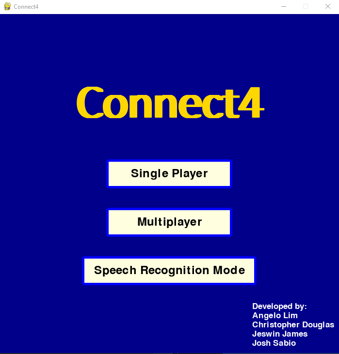
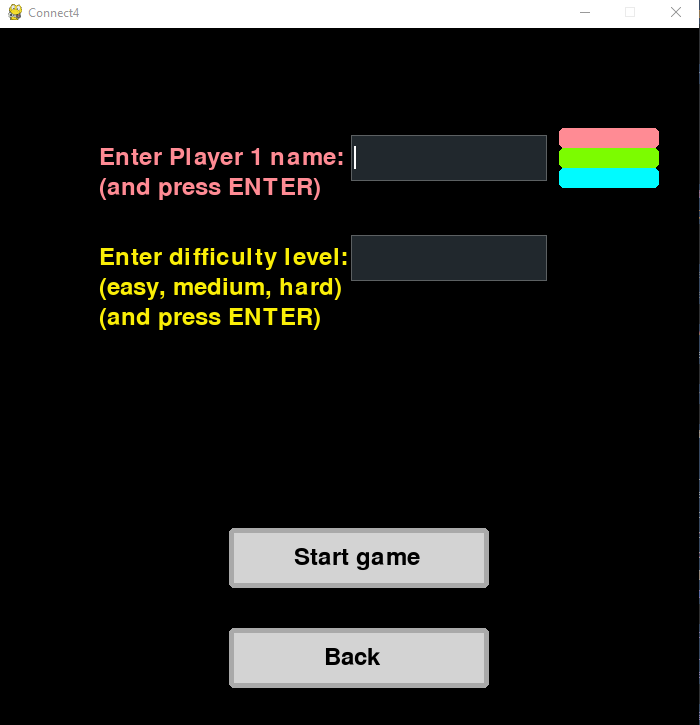
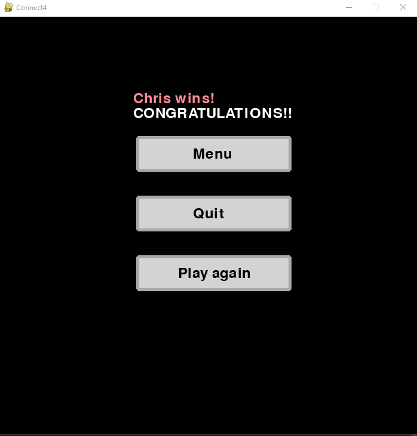

# Connect4 with Speech Recognition

Welcome to Connect4 with Speech Recognition, where we blend the classic Connect 4 game with cutting-edge speech recognition technology. This project not only brings you the nostalgic enjoyment of Connect 4 but also adds a modern twist by allowing players to make moves using their voice. The inclusion of a graphical user interface (GUI) enhances the overall gaming experience, providing a seamless and intuitive way to play. With the addition of a multi-level difficulty AI, players with competitive spirits will be challenged as they increase their AI opponent's difficulty.

## Key Features

- **Speech Recognition Technology:** Make your moves by simply speaking, adding a new level of accessibility and interaction to the game.

- **User-Friendly GUI:** The graphical user interface has been thoughtfully designed for easy navigation, making gameplay more enjoyable for users of all levels.

- **Multiple Game Types:** Choose from a variety of game types, including local multiplayer matches and battles against a CPU opponent with adjustable difficulty levels.

- **Innovative Gameplay:** Experience the classic Connect 4 game in a new and engaging way, combining tradition with technology.

## Screenshots/Mockups

### Connect 4 Main Menu:

### Connect 4 Multiplayer Menu:

### Connect 4 Single Player Menu:

### Connect 4 Victory Screen:


<!-- Add a screenshot or a mockup of your application in action to give users a visual preview of what to expect. -->

## How to Contribute

Stay up-to-date with the latest project status by following our [Project Board](https://github.com/orgs/cis3296f23/projects/109). We welcome contributions from the community to make Connect4 with Speech Recognition even better!

## How to Build

To contribute or run the project locally, follow these steps:

1. Use PyCharm Professional as your Integrated Development Environment (IDE).

2. Clone the repository:

    ```bash
    git clone https://github.com/cis3296f23/Connect4_SpeechRecognition.git
    ```

3. Install the required packages:

    ```bash
    pip install pygame numpy pygame-gui pyaudio SpeechRecognition
    ```

4. Run `main.py` to launch the Connect4 with Speech Recognition game.

### or 

1. Simply download and run the Connect4.exe file!


## How to Update Executable File

1. In PyCharm make sure project is up to date with most recent changes.

2. Install the pyinstaller package:

    ```bash
    pip install pyinstaller
    ```

3. In the Terminal run the command:

    ```bash
    pyinstaller main.py --onefile --name Connect4 
    ```

4. Executable file should be located in the dist/ folder of the project.


   
   


Your feedback and contributions are highly valued. Let's make Connect4 with Speech Recognition a memorable and enjoyable experience for everyone!
